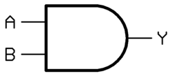
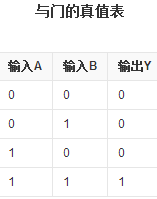

# Homework05

## part1

1)AND gate:boolean expression:X=A·B;与门：当两个输入均为1时才输出1，其余情况全部输出0.

2）XOR gate:boolean expression:X=A⊕B;异或门：两输入相同时输出0，两输入不同时输出1.

## part2
7)①(X8X7X6X51111)2
  ②(X8X7X6X5X4'X3'X2'X1')2
  ③（X8X7X6X5X4'X3'X2'X1')2

## part3
1)logic gate:In electronics, a logic gate is an idealized or physical device implementing a Boolean function; that is, it performs a logical operation on one or more binary inputs and produces a single binary output.

逻辑门电路：在电学中，逻辑门是一种应用布尔函数的理想化的或实体的设备；即它对一个或多个二进制输入实行逻辑运算后，输出一个二进制数。

2）boolean algebra:In mathematics and mathematical logic, Boolean algebra is the branch of algebra in which the values of the variables are the truth values true and false, usually denoted 1 and 0 respectively.

布尔代数：在数学和数学逻辑中，布尔代数是代数学中的一个分支。变量值为真和假，通常分别用1和0表示。

1）触发器

2）one bit