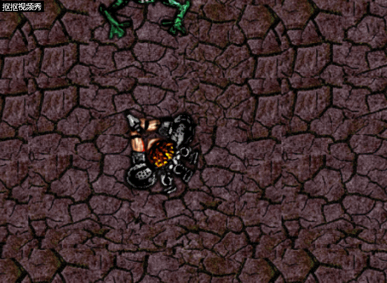

# 如何用Construct2制作猎人打怪小游戏

## 前期准备工作

前往https://www.scirra.com/construct2 下载并安装construct2

## 开始制作

打开construct2,如图操作。

## Layout

1、选取背景图片（例如下图）进行平铺

在layout中双击白色背景，在弹窗中选择Tiled Background > Insert
十字图标点击中间附近的位置，在弹窗中选择load an image from a file,选择之前下载好的背景图片，窗口中便会显示之前下载的图片，之后点窗口右上角的X退出纹理编辑器，会发现背景图片已经出现在屏幕中间了。接下来，我们在左侧的参数栏中调整position为0，0，size为1280，1024。

2、添加图层

在右侧栏中选择“layers”，点击铅笔图标，将0图层名称改为Background。点击锁图标，锁定图层以防更改。点击加号，添加图层命名为“Main”。

3、添加对象

选中Main图层，双击插入新对象。这次选择“Mouse”。同样操作添加“Keyboard”。接下来，我们添加游戏对象。

玩家:

怪兽:

子弹:

特效:

这次我们双击选择添加“Sprite”，依次选择以上四个图片，并在左侧栏中将"Name"改为player,monster,bullet,explode。

4、添加行为

首先，我们给玩家添加"8 direction movement"的行为。选中玩家，点击左侧的Behaviors,在弹窗中点击加号添加"8Direction"

同样，我们为玩家添加ScrollTo,BoundToLayout行为。

接下来，与之前相同，我们为子弹添加bullet movement和destroy outside layout；为怪兽添加bullet movement;为特效添加fade。
我们选中怪兽，在左侧栏中将其速度由400改为80，同样地，将子弹速度改为600，将特效的fade out time改为0.5.

5、增加怪兽数量

按住control，拖拽怪兽即可。我们总共需要8只怪兽，分布尽量分散。

## Event

我们将注意力转移到event sheet1。我们在event界面双击，选择system > Everytick。继续选择右侧的"add action",这回选择player > set angle toward position，在X、Y处分别输入Mouse.X、Mouse.Y。

选择add event:Mouse -> On click -> Left clicked ;选择add action:Player -> Spawn another object,object选择bullet,layer选择1，image point是0.

接下来，我们调整使子弹从枪口射出。在右侧栏objects中，右击player，选择edit animations，在弹窗中选择set origin and image points,点击加号，将新出现的定位点定位在手枪末端，并将image point改为1。

选择add event:Bullet -> On collision with another object -> Monster.;add action: Monster -> Destroy;add action:Bullet -> Spawn another object -> Explode, layer1;add action:Bullet -> Destroy

运行游戏，我们会发现特效会有黑色边框，接下来，我们针对特效进行一些处理。选中explode，在左侧栏中将blend mode调成addtive。

为了让游戏更有趣，我们进行如下操作：

1、add event:System -> On start of Layout;add action:Monster -> Set angle -> random(360)

2、add event:Monster -> Is outside layout;add action:Monster -> Set angle toward position -> X:Player.X  Y:Player.Y.

我们还可以通过更改instance variables更改怪兽的寿命。点击右侧栏的monster，在左侧栏中选择instance variables，在弹窗中点击加号，命名为health，将value改为你希望的寿命值。同时，我们需要对event的设置进行相应的更改。回到event界面，找到Bullet - on collision with Monster，右击，选择replace action > substract > value:1。这样每次击中怪兽，怪兽会掉一滴血。选择add event： Monster -> Compare instance variable -> Health, Less or equal, 0；add action： Monster -> Spawn another object -> Explode, layer 1；add action：Monster -> Destroy

最后我们来展示一下成果