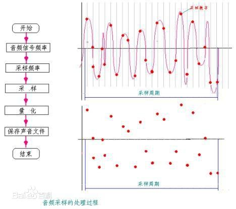

#声音的储存

我们平时听到的声音是由声波引起耳膜震动产生的，而计算机是以二进制储存数据的。在电脑上表示声音数据需要将声波数字化，一种方式是将声音的模拟量数字化。我们经常需要用到模数转换器。模拟量的数字化可以分为两步：（1)采样（2）量化。

##1.采样
采样是指把连续量转化成离散量的过程。一般是每间隔相等的一小段时间就采样一次。采样频率越大，声音就越真实，同时，数据量也越多。但采样频率高于某一定值后，多余的数据是无用的，人耳无法辨别其区别。

##2.量化
量化是指把幅度上连续取值（模拟量）的每一个样本转换为离散值（数字值）表示，因此量化过程也称为A/D转换。量化位数越多，音质越好，同样也会造成更大的数据量。

##3.声音储存量
声音储存量=（采样频率×量化位数×声道数×时间）/8

##4.声音的储存格式
声音的储存格式有WAV,AU,AIFF,VQF和MP3,其中MP3是使用最广泛的。

