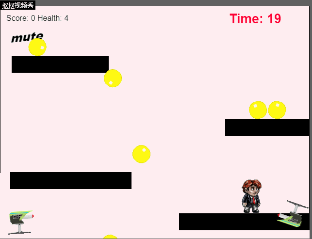

# Html5游戏设计与制作（进阶篇）

## 游戏策划
最近很流行跑酷的游戏，选择这个游戏的初衷就是模仿流行的跑酷游戏。游戏主要由小人、阶梯、子弹发射器、子弹、时间、分数和背景构成。
玩家可以控制上下左右键，使小人通过弹跳与黄球碰撞得分。而当小人被子弹射中，则会导致生命值下降。子弹发射器可以向不同角度发射子弹，为游戏增添挑战性。若小人从台阶上掉落，生命值也会相应减少。

## 游戏设计小结
object name:player
attribute:图片，位置
collaborator:sprite
events&actions:与子弹、子弹发射器碰撞，生命值-1；与黄球碰撞，分数+1；可以跑动（running）和站立（standing）

object name:bullet
attribute:图片，位置
collaborator:sprite
events&actions:与玩家碰撞后消失

object name:yellow ball
attribute:图片，位置
collaborator:sprite
events&actions:与玩家碰撞后消失
